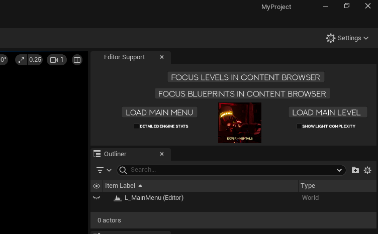

# EXPERIMENTALS

Experi-Mentals is a small game demo about awaking within a Broken Lab finding yourself stunned in a fallen elevator being forced to walk through the Lab to escape. However, you encounter some Locked Doors and Active Security Systems ready to eliminate you at anytime so be weary!

  
  

## Technical Video - Available on Youtube and in Repository

  

## Repository Initialisation

1. Clone this Repository using Github Desktop (or preferred method)
2. Open "MyProject.uproject" and open with Unreal Engine 5.4.4 or (5.x.x)

• All Maps are located in Content > Maps

• All Blueprints are located in Content > Blueprint

**System Requirements**

• Windows 10/11 (64-bit Only)

• At least 4GB of Storage (including Unreal Project and Self Extractor)

• At least NVIDIA 1660 GTX GPU or Greater

• .NET 8.0 Runtime (for Game Launcher)

## Play Styles
The Game has been tested using :

• Keyboard and Mouse (recommended)

• Xbox Series S Controller

**Controls**
- WASD or Left Analog Stick - Move
- Shift or Press Left Analog Stick - Sprint
- Mouse or Right Analog Stick - Rotate Player
- Spacebar or A (Xbox) - Jump
- E or X (Xbox) - Interact
- F - Flashlight
- D - Dash

# Moderation Notices

## Player Blueprint - Most Worked On Blueprint
>[!NOTE]
> The Player Blueprint contains most of the required content for Game Intialisation; containing all systems such as Sprinting / Flashlight and HUD Updated.
> This will be located in Content > Blueprints > PlayerBlueprints

  

## Game Launcher
You may use this application to download the Base Game and open the Unreal Project.
You don't need to use this at all.

You do need *.NET 8.0* to open this application. Windows should automatically help you install this dependancy.

>[!NOTE]
> If you have installed Unreal Engine in an *abnormal path*, the Launcher *won't detect Unreal Engine* however will still attempt to load the .uproject file through the Windows Shell.

  
  

## Editor Support Window
>[!NOTE]
> When you initalise this project, you will have an Editor Support Window that'll allow you to transverse to different parts of the project seemlessly.
> This initialises through an Python Startup Script located in the Project Settings.

  
  

**External Plugins and Applications**
- Unreal Recovery Service
- WinRAR Self Extractor
